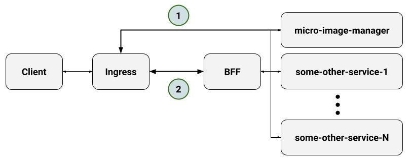

micro-image-manager is not limited to one specific architecture or model. Here we propose a simple general architecture to use easily and elegantly.

In our architecture, we have two types of traffic to micro-image-manager.

- (#1) Public requests to `/image/*` send to micro-image-manager. It efficiently serves your images publicly behind ingress (or anything else you use for routing).
- (#2) Requests to `/api/v1/images` send to micro-image-manager by BFF (backend as front-end) internally. When the client wants to upload a new image, it posts it to BFF, and BFF, based on the authentication, validation, and any access definitions you have, sends the data to a micro-image-manager. Of course, that is not the only task of BFF and it's still there to help to design your API more smoothly and securely for your client. For more information, check the BBF design pattern.
